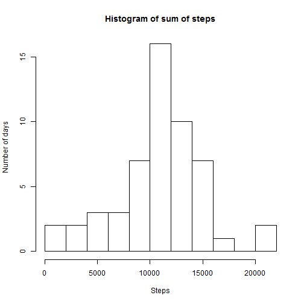
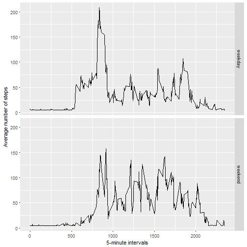

Reproducible Research Week 2 Peer-Graded Assignment
======================================

This markdown file includes the R code that answers the following questions 
based on the activity monitoring dataset.

        1. Code for reading in the dataset and/or processing the data
        2. Histogram of the total number of steps taken each day
        3. Mean and median number of steps taken each day
        4. Time series plot of the average number of steps taken
        5. The 5-minute interval that, on average, contains the maximum number of steps
        6. Code to describe and show a strategy for imputing missing data
        7. Histogram of the total number of steps taken each day after missing values 
           are imputed
        8. Panel plot comparing the average number of steps taken per 5-minute interval 
           across weekdays and weekends
           
##Load relevant R packages


```r
suppressWarnings(library(ggplot2))
suppressWarnings(library(Hmisc))
suppressWarnings(library(dplyr))
```

```
## 
## Attaching package: 'dplyr'
```

```
## The following objects are masked from 'package:Hmisc':
## 
##     combine, src, summarize
```

```
## The following objects are masked from 'package:stats':
## 
##     filter, lag
```

```
## The following objects are masked from 'package:base':
## 
##     intersect, setdiff, setequal, union
```
   
##Reading and formatting the date variable 


```r
url <- "https://d396qusza40orc.cloudfront.net/repdata%2Fdata%2Factivity.zip"

download.file(url, "./activity.zip")

unzip("./activity.zip")

activity <- read.csv("./activity.csv")

activity$date <- as.Date(activity$date, format="%Y-%m-%d")
```

##Imputing missing values

Create a new dataset that is equal to the original one but with missing 
values imputed with mean values (Code chunk placed here as unknown error occuring
when placed at the end)


```r
activity_new <- activity
activity_new$steps <- impute(activity$steps, fun=mean)
```

##Histogram of the sum of steps taken each day 


```r
sum <- aggregate(activity$steps~activity$date, activity, sum)

hist(sum$`activity$steps`, breaks=10, xlab="Steps", ylab="Number of days", 
     main = "Histogram of sum of steps")
```



##Mean and median of the number of steps taken per day


```r
mean(sum$`activity$steps`)
```

```
## [1] 10766.19
```

```r
median(sum$`activity$steps`)
```

```
## [1] 10765
```


##Time-series plot of average number of steps taken each day


```r
mean <- aggregate(activity$steps~activity$date, activity, mean)

ggplot(mean, aes(mean$`activity$date`, mean$`activity$steps`)) + 
        geom_line() + labs(title= "Time-series plot of average steps per day") + 
        labs(x="Date") + labs(y="Average steps per day")
```


##Time-series plot of average steps taken in 5-minute intervals 


```r
mean_interval <- aggregate(activity$steps~activity$interval, activity, FUN="mean")

ggplot(mean_interval, aes(mean_interval$`activity$interval`, mean_interval$`activity$steps`)) + 
        geom_line() + labs(title= "Time-series plot of average steps per day interval-wise") + 
        labs(x="Interval") + labs(y="Average steps per day")
```


##5-minute interval maximum number of steps


```r
sum_interval <- aggregate(activity$steps~activity$interval, activity, FUN="sum")

max_interval <- sum_interval[which.max(sum_interval$`activity$steps`), ]

print(max_interval)
```

```
##     activity$interval activity$steps
## 104               835          10927
```

##Histogram of the sum of steps taken each day after missing values imputed 


```r
sum_new <- aggregate(activity_new$steps~activity_new$date, activity_new, FUN="sum")

hist(sum_new$`activity_new$steps`, breaks =10, xlab="Steps", ylab="Number of days", 
     main = "Histogram of sum of steps")
```


```r
mean(sum_new$`activity_new$steps`)
```

```
## [1] 10766.19
```

```r
median(sum_new$`activity_new$steps`)
```

```
## [1] 10766.19
```

##Comparing differences in activity on weekdays and weekends


```r
activity_new$dateType <-  ifelse(as.POSIXlt(activity_new$date)$wday %in% c(0,6), 'weekend', 'weekday')

averaged_activity_new <- aggregate(steps ~ interval + dateType, data=activity_new, FUN ="mean")

ggplot(averaged_activity_new, aes(interval, steps)) + geom_line() + 
        facet_grid(dateType ~ .) + xlab("5-minute intervals") + 
        ylab("Average number of steps")
```


